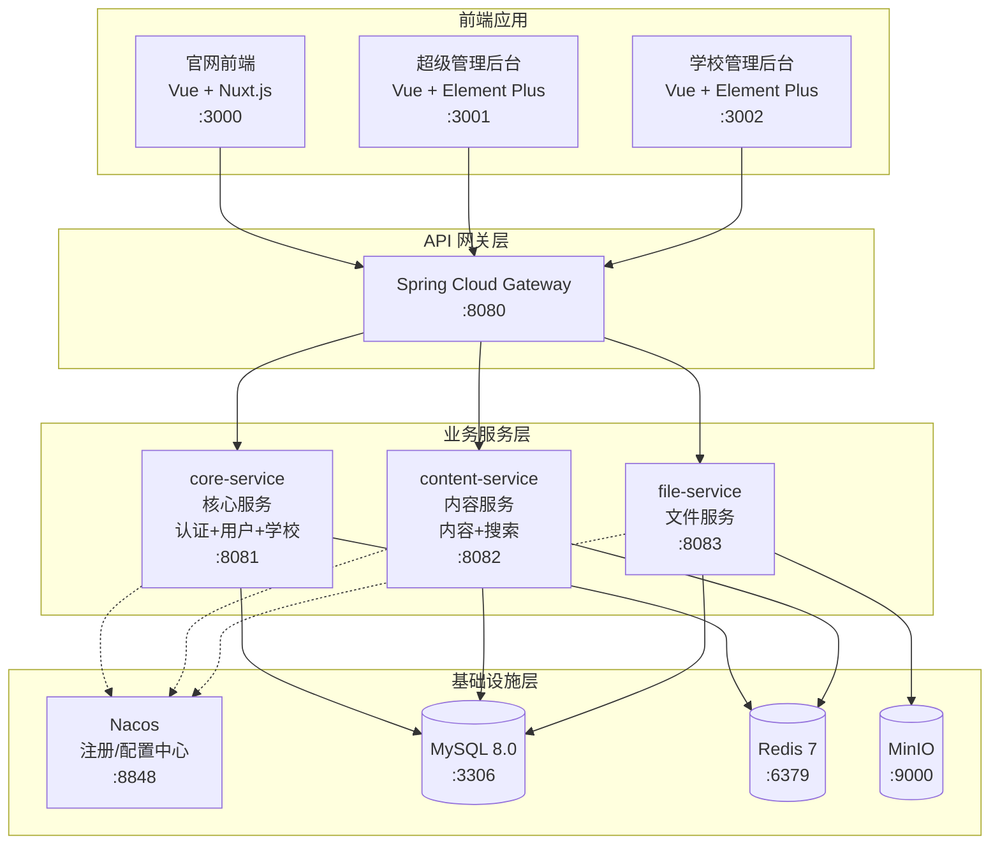
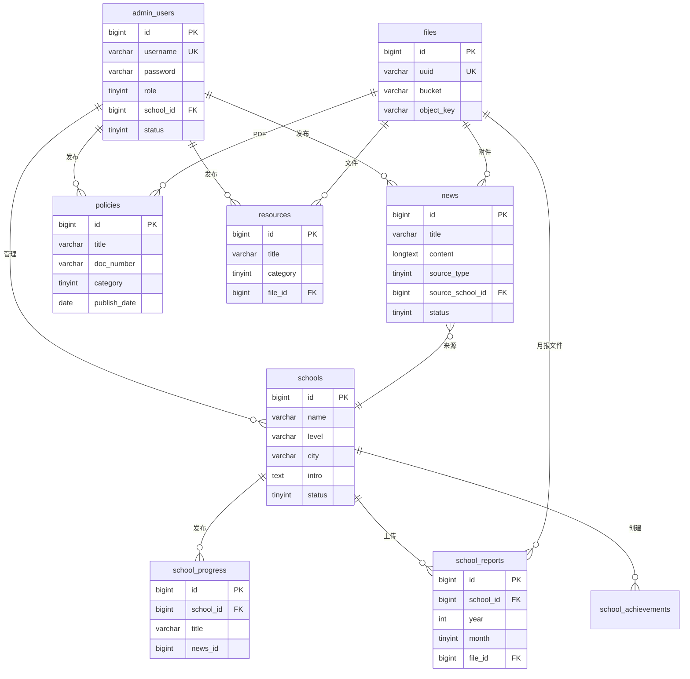

# 系统架构文档

# 河南城乡学校共同体发展平台

---

## 文档信息

| 项目 | 内容 |
|------|------|
| **文档类型** | 系统架构 |
| **版本** | 1.0.0 |
| **状态** | 已定稿 |
| **创建日期** | 2026-02-04 |
| **项目名称** | edu-community-platform |
| **架构模式** | 微服务架构 |

---

## 目录

1. [架构概述](#一架构概述)
2. [技术栈](#二技术栈)
3. [服务拓扑](#三服务拓扑)
4. [API 契约摘要](#四api-契约摘要)
5. [数据库设计](#五数据库设计)
6. [集成策略](#六集成策略)
7. [部署架构](#七部署架构)
8. [安全架构](#八安全架构)
9. [横切关注点](#九横切关注点)
10. [架构决策记录](#十架构决策记录)

---

## 一、架构概述

### 1.1 架构模式

采用 **Spring Cloud 微服务架构**，将系统拆分为 **3 个业务服务**，通过 API 网关统一对外提供服务。

```
┌─────────────────────────────────────────────────────────────────────────────┐
│                              客户端层                                        │
├─────────────────┬─────────────────┬─────────────────────────────────────────┤
│   官网前端       │   超级管理后台    │         学校管理后台                     │
│  (Vue + Nuxt)   │ (Vue + Element)  │       (Vue + Element)                   │
└────────┬────────┴────────┬─────────┴──────────────┬──────────────────────────┘
         │                 │                        │
         └─────────────────┼────────────────────────┘
                           ▼
┌─────────────────────────────────────────────────────────────────────────────┐
│                         API 网关 (Spring Cloud Gateway)                      │
│                    统一认证 | 路由转发 | 限流熔断 | 日志                       │
└─────────────────────────────────────────────────────────────────────────────┘
                           │
         ┌─────────────────┼─────────────────┐
         ▼                 ▼                 ▼
┌─────────────────┐ ┌─────────────────┐ ┌─────────────────┐
│    核心服务      │ │    内容服务      │ │    文件服务      │
│ (core-service)  │ │(content-service)│ │ (file-service)  │
│ 认证+用户+学校   │ │  内容+搜索       │ │   文件管理       │
└────────┬────────┘ └────────┬────────┘ └────────┬────────┘
         │                   │                   │
         └─────────────────┬─┴───────────────────┘
                           ▼
┌─────────────────────────────────────────────────────────────────────────────┐
│                           基础设施层                                          │
├─────────────────┬─────────────────┬─────────────────┬───────────────────────┤
│   MySQL 8.0     │    Redis 7      │     MinIO       │   Nacos (注册/配置)    │
└─────────────────┴─────────────────┴─────────────────┴───────────────────────┘
```

### 1.2 设计原则

| 原则 | 说明 |
|------|------|
| **服务自治** | 每个微服务独立部署、独立数据库、独立扩展 |
| **API 优先** | 所有服务间通信通过 RESTful API |
| **安全优先** | 符合等保三级要求，全链路加密 |
| **高可用** | 关键服务多实例部署，支持故障转移 |
| **可观测** | 统一日志、链路追踪、健康检查 |

---

## 二、技术栈

### 2.1 后端技术栈

| 层级 | 技术 | 版本 | 说明 |
|------|------|------|------|
| **运行环境** | JDK | 21 (LTS) | 长期支持版本 |
| **基础框架** | Spring Boot | 3.2.x | 微服务基础框架 |
| **微服务框架** | Spring Cloud | 2023.0.x | 微服务治理 |
| **服务注册/配置** | Nacos | 2.3.x | 服务发现与配置中心 |
| **API 网关** | Spring Cloud Gateway | 4.1.x | 统一入口、路由、限流 |
| **服务调用** | OpenFeign | 4.1.x | 声明式 HTTP 客户端 |
| **熔断降级** | Sentinel | 1.8.x | 流量控制、熔断降级 |
| **ORM 框架** | MyBatis-Plus | 3.5.x | 数据库访问 |
| **数据库连接池** | HikariCP | 5.x | 高性能连接池 |
| **缓存** | Spring Data Redis | 3.2.x | Redis 客户端 |
| **安全框架** | Spring Security | 6.2.x | 认证授权 |
| **JWT** | jjwt | 0.12.x | Token 生成与验证 |
| **参数校验** | Hibernate Validator | 8.x | 请求参数校验 |
| **API 文档** | SpringDoc OpenAPI | 2.3.x | Swagger/OpenAPI 3.0 |
| **日志框架** | SLF4J + Logback | - | 结构化日志 |

### 2.2 前端技术栈

| 应用 | 技术栈 | 版本 | 说明 |
|------|--------|------|------|
| **官网前端** | Vue 3 + Nuxt 3 | Vue 3.4.x / Nuxt 3.10.x | SSR 服务端渲染，SEO 友好 |
| **超级管理后台** | Vue 3 + Element Plus | Vue 3.4.x / Element Plus 2.5.x | 企业级后台 UI |
| **学校管理后台** | Vue 3 + Element Plus | Vue 3.4.x / Element Plus 2.5.x | 复用管理后台组件 |
| **构建工具** | Vite | 5.x | 快速构建 |
| **状态管理** | Pinia | 2.x | Vue 3 官方状态管理 |
| **HTTP 客户端** | Axios | 1.6.x | API 请求 |
| **富文本编辑器** | WangEditor | 5.x | 内容编辑 |

### 2.3 基础设施

| 组件 | 技术 | 版本 | 部署方式 |
|------|------|------|----------|
| **数据库** | MySQL | 8.0.36 | 主从复制 |
| **缓存** | Redis | 7.2.x | Sentinel 哨兵模式 |
| **文件存储** | MinIO | RELEASE.2024-01 | 集群部署 |
| **消息队列** | RabbitMQ | 3.13.x | 镜像队列 (可选) |
| **反向代理** | Nginx | 1.24.x | 负载均衡、SSL 终止 |
| **容器化** | Docker | 24.x | 容器运行时 |
| **容器编排** | Docker Compose / K8s | - | 服务编排 |

---

## 三、服务拓扑

### 3.1 微服务划分



### 3.2 服务职责定义

| 服务名称 | 端口 | 职责描述 | 主要功能 |
|----------|------|----------|----------|
| **gateway** | 8080 | API 网关 | 路由转发、认证校验、限流熔断、日志记录 |
| **core-service** | 8081 | 核心服务 | 登录认证、Token 管理、管理员账号、权限管理、示范校管理、校共体介绍、项目进展、月报 |
| **content-service** | 8082 | 内容服务 | 政策文件、新闻资讯、资源共享、项目介绍、栏目管理、全站搜索、敏感词过滤 |
| **file-service** | 8083 | 文件服务 | 文件上传、下载、预览、MinIO 管理 |

### 3.3 服务间依赖关系

```
gateway
├── core-service (认证校验)
├── content-service
└── file-service

core-service
├── file-service (学校图片、月报附件上传)
└── content-service (项目进展同步至新闻资讯)

content-service
├── file-service (政策PDF、资源文件上传)
└── core-service (获取学校信息用于新闻来源标识)
```

---

## 四、API 契约摘要

### 4.1 API 版本策略

- **版本格式**: URL 路径版本，如 `/api/v1/users`
- **当前版本**: v1
- **向后兼容**: 新版本发布后，旧版本保留至少 6 个月

### 4.2 核心服务 API (core-service)

#### 4.2.1 认证 API

| 方法 | 路径 | 描述 | 认证 |
|------|------|------|------|
| POST | `/api/v1/auth/login` | 管理员登录 | 公开 |
| POST | `/api/v1/auth/logout` | 退出登录 | 需认证 |
| POST | `/api/v1/auth/refresh` | 刷新 Token | 需认证 |
| PUT | `/api/v1/auth/password` | 修改密码 | 需认证 |
| POST | `/api/v1/auth/password/reset` | 重置密码 | 超级管理员 |

**登录请求/响应示例**:

```json
// POST /api/v1/auth/login
// Request
{
  "username": "admin",
  "password": "encrypted_password",
  "role": "super_admin"  // super_admin | school_admin
}

// Response 200 OK
{
  "code": 200,
  "message": "success",
  "data": {
    "access_token": "eyJhbGciOiJIUzI1NiIs...",
    "refresh_token": "eyJhbGciOiJIUzI1NiIs...",
    "expires_in": 900,
    "token_type": "Bearer",
    "user": {
      "id": 1,
      "username": "admin",
      "name": "管理员",
      "role": "super_admin",
      "school_id": null
    }
  }
}
```

#### 4.2.2 用户管理 API

| 方法 | 路径 | 描述 | 认证 |
|------|------|------|------|
| GET | `/api/v1/users` | 获取用户列表 | 超级管理员 |
| GET | `/api/v1/users/{id}` | 获取用户详情 | 需认证 |
| POST | `/api/v1/users` | 创建用户 | 超级管理员 |
| PUT | `/api/v1/users/{id}` | 更新用户 | 超级管理员 |
| DELETE | `/api/v1/users/{id}` | 删除用户 | 超级管理员 |
| PUT | `/api/v1/users/{id}/status` | 启用/禁用用户 | 超级管理员 |
| GET | `/api/v1/users/profile` | 获取当前用户信息 | 需认证 |
| PUT | `/api/v1/users/profile` | 更新当前用户信息 | 需认证 |

#### 4.2.3 学校管理 API

**示范校**

| 方法 | 路径 | 描述 | 认证 |
|------|------|------|------|
| GET | `/api/v1/schools` | 获取学校列表 | 公开 |
| GET | `/api/v1/schools/{id}` | 获取学校详情 | 公开 |
| POST | `/api/v1/schools` | 创建学校 | 超级管理员 |
| PUT | `/api/v1/schools/{id}` | 更新学校基础信息 | 超级管理员 |
| PUT | `/api/v1/schools/{id}/intro` | 更新校共体介绍 | 学校管理员 |
| DELETE | `/api/v1/schools/{id}` | 删除学校 | 超级管理员 |
| PUT | `/api/v1/schools/{id}/status` | 启用/禁用学校 | 超级管理员 |

**项目进展**

| 方法 | 路径 | 描述 | 认证 |
|------|------|------|------|
| GET | `/api/v1/schools/{schoolId}/progress` | 获取项目进展列表 | 公开 |
| GET | `/api/v1/schools/{schoolId}/progress/{id}` | 获取进展详情 | 公开 |
| POST | `/api/v1/schools/{schoolId}/progress` | 创建项目进展 | 学校管理员 |
| PUT | `/api/v1/schools/{schoolId}/progress/{id}` | 更新项目进展 | 学校管理员 |
| DELETE | `/api/v1/schools/{schoolId}/progress/{id}` | 删除项目进展 | 学校管理员 |

**月报管理**

| 方法 | 路径 | 描述 | 认证 |
|------|------|------|------|
| GET | `/api/v1/schools/{schoolId}/reports` | 获取月报列表 | 需认证 |
| GET | `/api/v1/schools/{schoolId}/reports/{id}` | 获取月报详情 | 需认证 |
| POST | `/api/v1/schools/{schoolId}/reports` | 上传月报 | 学校管理员 |
| PUT | `/api/v1/schools/{schoolId}/reports/{id}` | 更新月报 | 学校管理员 |
| DELETE | `/api/v1/schools/{schoolId}/reports/{id}` | 删除月报 | 学校管理员 |

**资源成果**

| 方法 | 路径 | 描述 | 认证 |
|------|------|------|------|
| GET | `/api/v1/schools/{schoolId}/achievements` | 获取资源成果列表 | 公开 |
| GET | `/api/v1/schools/{schoolId}/achievements/{id}` | 获取成果详情 | 公开 |
| POST | `/api/v1/schools/{schoolId}/achievements` | 创建资源成果 | 学校管理员 |
| PUT | `/api/v1/schools/{schoolId}/achievements/{id}` | 更新资源成果 | 学校管理员 |
| DELETE | `/api/v1/schools/{schoolId}/achievements/{id}` | 删除资源成果 | 学校管理员 |

### 4.3 内容服务 API (content-service)

#### 4.3.1 政策文件

| 方法 | 路径 | 描述 | 认证 |
|------|------|------|------|
| GET | `/api/v1/policies` | 获取政策列表 | 公开 |
| GET | `/api/v1/policies/{id}` | 获取政策详情 | 公开 |
| POST | `/api/v1/policies` | 创建政策 | 超级管理员 |
| PUT | `/api/v1/policies/{id}` | 更新政策 | 超级管理员 |
| DELETE | `/api/v1/policies/{id}` | 删除政策 | 超级管理员 |

#### 4.3.2 新闻资讯

| 方法 | 路径 | 描述 | 认证 |
|------|------|------|------|
| GET | `/api/v1/news` | 获取新闻列表 | 公开 |
| GET | `/api/v1/news/{id}` | 获取新闻详情 | 公开 |
| POST | `/api/v1/news` | 创建新闻 | 需认证 |
| PUT | `/api/v1/news/{id}` | 更新新闻 | 需认证 |
| DELETE | `/api/v1/news/{id}` | 删除新闻 | 超级管理员 |
| GET | `/api/v1/news/{id}/views` | 获取浏览统计 | 超级管理员 |

#### 4.3.3 资源共享

| 方法 | 路径 | 描述 | 认证 |
|------|------|------|------|
| GET | `/api/v1/resources` | 获取资源列表 | 公开 |
| GET | `/api/v1/resources/{id}` | 获取资源详情 | 公开 |
| POST | `/api/v1/resources` | 创建资源 | 超级管理员 |
| PUT | `/api/v1/resources/{id}` | 更新资源 | 超级管理员 |
| DELETE | `/api/v1/resources/{id}` | 删除资源 | 超级管理员 |
| GET | `/api/v1/resources/{id}/download` | 下载资源 | 公开 |

#### 4.3.4 栏目管理

| 方法 | 路径 | 描述 | 认证 |
|------|------|------|------|
| GET | `/api/v1/columns` | 获取栏目列表 | 公开 |
| GET | `/api/v1/columns/{id}` | 获取栏目详情 | 公开 |
| POST | `/api/v1/columns` | 创建栏目 | 超级管理员 |
| PUT | `/api/v1/columns/{id}` | 更新栏目 | 超级管理员 |
| DELETE | `/api/v1/columns/{id}` | 删除栏目 | 超级管理员 |
| PUT | `/api/v1/columns/{id}/sort` | 栏目排序 | 超级管理员 |

#### 4.3.5 轮播图管理

| 方法 | 路径 | 描述 | 认证 |
|------|------|------|------|
| GET | `/api/v1/banners` | 获取轮播图列表 | 公开 |
| POST | `/api/v1/banners` | 创建轮播图 | 超级管理员 |
| PUT | `/api/v1/banners/{id}` | 更新轮播图 | 超级管理员 |
| DELETE | `/api/v1/banners/{id}` | 删除轮播图 | 超级管理员 |

#### 4.3.6 搜索 API

| 方法 | 路径 | 描述 | 认证 |
|------|------|------|------|
| GET | `/api/v1/search` | 全站搜索 | 公开 |
| GET | `/api/v1/search/policies` | 搜索政策文件 | 公开 |
| GET | `/api/v1/search/news` | 搜索新闻资讯 | 公开 |
| GET | `/api/v1/search/schools` | 搜索示范校 | 公开 |
| GET | `/api/v1/search/resources` | 搜索资源共享 | 公开 |
| POST | `/api/v1/search/index/rebuild` | 重建索引 | 超级管理员 |

**搜索请求/响应示例**:

```json
// GET /api/v1/search?keyword=教育&module=all&page=1&size=10

// Response 200 OK
{
  "code": 200,
  "message": "success",
  "data": {
    "total": 56,
    "page": 1,
    "size": 10,
    "items": [
      {
        "id": 1,
        "title": "河南省义务教育一体化实施方案",
        "module": "policy",
        "module_name": "政策文件",
        "summary": "...关于推进城乡教育一体化发展...",
        "publish_time": "2026-01-15T08:00:00Z",
        "url": "/policy/1"
      }
    ]
  }
}
```

### 4.4 文件服务 API (file-service)

| 方法 | 路径 | 描述 | 认证 |
|------|------|------|------|
| POST | `/api/v1/files/upload` | 上传文件 | 需认证 |
| POST | `/api/v1/files/upload/image` | 上传图片 | 需认证 |
| GET | `/api/v1/files/{id}` | 获取文件信息 | 公开 |
| GET | `/api/v1/files/{id}/download` | 下载文件 | 公开 |
| GET | `/api/v1/files/{id}/preview` | 预览文件 | 公开 |
| DELETE | `/api/v1/files/{id}` | 删除文件 | 需认证 |

**文件上传请求/响应示例**:

```json
// POST /api/v1/files/upload
// Request: multipart/form-data
// - file: 文件二进制
// - type: image | document | video

// Response 200 OK
{
  "code": 200,
  "message": "success",
  "data": {
    "id": "550e8400-e29b-41d4-a716-446655440000",
    "filename": "policy.pdf",
    "original_name": "教育政策文件.pdf",
    "size": 1048576,
    "mime_type": "application/pdf",
    "url": "/api/v1/files/550e8400-e29b-41d4-a716-446655440000/download",
    "preview_url": "/api/v1/files/550e8400-e29b-41d4-a716-446655440000/preview",
    "created_at": "2026-02-04T10:30:00Z"
  }
}
```

### 4.5 系统设置 API (分布在 core-service 和 content-service)

| 方法 | 路径 | 描述 | 认证 |
|------|------|------|------|
| GET | `/api/v1/settings/site` | 获取站点配置 | 公开 |
| PUT | `/api/v1/settings/site` | 更新站点配置 | 超级管理员 |
| GET | `/api/v1/settings/sensitive-words` | 获取敏感词列表 | 超级管理员 |
| POST | `/api/v1/settings/sensitive-words` | 添加敏感词 | 超级管理员 |
| POST | `/api/v1/settings/sensitive-words/import` | 批量导入敏感词 | 超级管理员 |
| DELETE | `/api/v1/settings/sensitive-words/{id}` | 删除敏感词 | 超级管理员 |
| GET | `/api/v1/settings/backups` | 获取备份列表 | 超级管理员 |
| POST | `/api/v1/settings/backups` | 手动触发备份 | 超级管理员 |
| GET | `/api/v1/settings/links` | 获取友情链接 | 公开 |
| PUT | `/api/v1/settings/links` | 更新友情链接 | 超级管理员 |

---

## 五、数据库设计

### 5.1 数据库架构

采用 **逻辑分库** 策略，每个微服务使用独立的 Schema：

| Schema | 服务 | 说明 |
|--------|------|------|
| `edu_core` | core-service | 用户、认证、学校相关表 |
| `edu_content` | content-service | 内容管理、搜索相关表 |
| `edu_file` | file-service | 文件管理表 |

### 5.2 核心表设计

#### 5.2.1 管理员表 (edu_core.admin_users)

```sql
CREATE TABLE admin_users (
    id BIGINT PRIMARY KEY AUTO_INCREMENT COMMENT '主键ID',
    username VARCHAR(50) NOT NULL UNIQUE COMMENT '账号',
    password VARCHAR(255) NOT NULL COMMENT '密码(BCrypt加密)',
    salt VARCHAR(32) NOT NULL COMMENT '密码盐值',
    role TINYINT NOT NULL DEFAULT 2 COMMENT '角色: 1-超级管理员, 2-学校管理员',
    school_id BIGINT NULL COMMENT '关联学校ID(学校管理员必填)',
    name VARCHAR(50) NULL COMMENT '姓名',
    phone VARCHAR(20) NULL COMMENT '联系电话',
    email VARCHAR(100) NULL COMMENT '邮箱',
    avatar VARCHAR(255) NULL COMMENT '头像URL',
    status TINYINT NOT NULL DEFAULT 1 COMMENT '状态: 0-禁用, 1-启用',
    last_login_at DATETIME NULL COMMENT '最后登录时间',
    last_login_ip VARCHAR(45) NULL COMMENT '最后登录IP',
    login_fail_count INT NOT NULL DEFAULT 0 COMMENT '连续登录失败次数',
    locked_until DATETIME NULL COMMENT '锁定截止时间',
    created_by BIGINT NULL COMMENT '创建人ID',
    created_at DATETIME NOT NULL DEFAULT CURRENT_TIMESTAMP COMMENT '创建时间',
    updated_at DATETIME NOT NULL DEFAULT CURRENT_TIMESTAMP ON UPDATE CURRENT_TIMESTAMP COMMENT '更新时间',
    deleted_at DATETIME NULL COMMENT '删除时间(软删除)',

    INDEX idx_username (username),
    INDEX idx_school_id (school_id),
    INDEX idx_role (role),
    INDEX idx_status (status)
) ENGINE=InnoDB DEFAULT CHARSET=utf8mb4 COLLATE=utf8mb4_unicode_ci COMMENT='管理员表';
```

#### 5.2.2 示范校表 (edu_core.schools)

```sql
CREATE TABLE schools (
    id BIGINT PRIMARY KEY AUTO_INCREMENT COMMENT '主键ID',
    name VARCHAR(100) NOT NULL COMMENT '学校名称',
    code VARCHAR(50) NULL COMMENT '学校代码',
    level VARCHAR(20) NOT NULL COMMENT '学段: 小学/中学/高中',
    province VARCHAR(50) NOT NULL DEFAULT '河南省' COMMENT '省',
    city VARCHAR(50) NOT NULL COMMENT '市',
    county VARCHAR(50) NOT NULL COMMENT '县/区',
    address VARCHAR(255) NULL COMMENT '详细地址',
    phone VARCHAR(20) NULL COMMENT '联系电话',
    intro TEXT NULL COMMENT '校共体详细介绍',
    model TEXT NULL COMMENT '共同体组建模式',
    advantage TEXT NULL COMMENT '核心优势',
    images JSON NULL COMMENT '学校环境图片',
    logo VARCHAR(255) NULL COMMENT '学校Logo',
    status TINYINT NOT NULL DEFAULT 1 COMMENT '状态: 0-禁用, 1-启用',
    sort_order INT NOT NULL DEFAULT 0 COMMENT '排序(升序)',
    created_by BIGINT NULL COMMENT '创建人ID',
    created_at DATETIME NOT NULL DEFAULT CURRENT_TIMESTAMP COMMENT '创建时间',
    updated_at DATETIME NOT NULL DEFAULT CURRENT_TIMESTAMP ON UPDATE CURRENT_TIMESTAMP COMMENT '更新时间',
    deleted_at DATETIME NULL COMMENT '删除时间(软删除)',

    INDEX idx_name (name),
    INDEX idx_level (level),
    INDEX idx_city (city),
    INDEX idx_status (status),
    INDEX idx_sort_order (sort_order)
) ENGINE=InnoDB DEFAULT CHARSET=utf8mb4 COLLATE=utf8mb4_unicode_ci COMMENT='示范校表';
```

#### 5.2.3 新闻资讯表 (edu_content.news)

```sql
CREATE TABLE news (
    id BIGINT PRIMARY KEY AUTO_INCREMENT COMMENT '主键ID',
    title VARCHAR(200) NOT NULL COMMENT '标题',
    content LONGTEXT NOT NULL COMMENT '内容(富文本)',
    summary VARCHAR(500) NULL COMMENT '摘要',
    cover_image VARCHAR(255) NULL COMMENT '封面图',
    source_type TINYINT NOT NULL DEFAULT 1 COMMENT '来源类型: 1-平台, 2-学校',
    source_school_id BIGINT NULL COMMENT '来源学校ID',
    attachments JSON NULL COMMENT '附件列表',
    external_link VARCHAR(500) NULL COMMENT '外部链接',
    view_count INT NOT NULL DEFAULT 0 COMMENT '浏览次数',
    status TINYINT NOT NULL DEFAULT 0 COMMENT '状态: 0-草稿, 1-已发布, 2-已删除',
    is_top TINYINT NOT NULL DEFAULT 0 COMMENT '是否置顶: 0-否, 1-是',
    publish_time DATETIME NULL COMMENT '发布时间',
    created_by BIGINT NOT NULL COMMENT '创建人ID',
    created_at DATETIME NOT NULL DEFAULT CURRENT_TIMESTAMP COMMENT '创建时间',
    updated_at DATETIME NOT NULL DEFAULT CURRENT_TIMESTAMP ON UPDATE CURRENT_TIMESTAMP COMMENT '更新时间',
    deleted_at DATETIME NULL COMMENT '删除时间(软删除)',
    deleted_by BIGINT NULL COMMENT '删除人ID',
    delete_reason VARCHAR(255) NULL COMMENT '删除原因',

    INDEX idx_source_type (source_type),
    INDEX idx_source_school_id (source_school_id),
    INDEX idx_status (status),
    INDEX idx_publish_time (publish_time),
    INDEX idx_is_top (is_top),
    FULLTEXT INDEX ft_title_content (title, content) WITH PARSER ngram
) ENGINE=InnoDB DEFAULT CHARSET=utf8mb4 COLLATE=utf8mb4_unicode_ci COMMENT='新闻资讯表';
```

#### 5.2.4 政策文件表 (edu_content.policies)

```sql
CREATE TABLE policies (
    id BIGINT PRIMARY KEY AUTO_INCREMENT COMMENT '主键ID',
    title VARCHAR(200) NOT NULL COMMENT '标题',
    doc_number VARCHAR(100) NULL COMMENT '文号',
    category TINYINT NOT NULL COMMENT '分类: 1-国家政策, 2-省级政策',
    content LONGTEXT NOT NULL COMMENT '内容(富文本)',
    pdf_url VARCHAR(500) NULL COMMENT 'PDF文件地址',
    interpretation TEXT NULL COMMENT '解读材料',
    publish_date DATE NOT NULL COMMENT '发布日期',
    source VARCHAR(100) NULL COMMENT '来源单位',
    status TINYINT NOT NULL DEFAULT 1 COMMENT '状态: 0-隐藏, 1-显示',
    sort_order INT NOT NULL DEFAULT 0 COMMENT '排序',
    view_count INT NOT NULL DEFAULT 0 COMMENT '浏览次数',
    download_count INT NOT NULL DEFAULT 0 COMMENT '下载次数',
    created_by BIGINT NOT NULL COMMENT '创建人ID',
    created_at DATETIME NOT NULL DEFAULT CURRENT_TIMESTAMP COMMENT '创建时间',
    updated_at DATETIME NOT NULL DEFAULT CURRENT_TIMESTAMP ON UPDATE CURRENT_TIMESTAMP COMMENT '更新时间',
    deleted_at DATETIME NULL COMMENT '删除时间(软删除)',

    INDEX idx_category (category),
    INDEX idx_publish_date (publish_date),
    INDEX idx_status (status),
    FULLTEXT INDEX ft_title (title) WITH PARSER ngram
) ENGINE=InnoDB DEFAULT CHARSET=utf8mb4 COLLATE=utf8mb4_unicode_ci COMMENT='政策文件表';
```

#### 5.2.5 资源共享表 (edu_content.resources)

```sql
CREATE TABLE resources (
    id BIGINT PRIMARY KEY AUTO_INCREMENT COMMENT '主键ID',
    title VARCHAR(200) NOT NULL COMMENT '标题',
    category TINYINT NOT NULL COMMENT '分类: 1-省外经验, 2-省内经验, 3-研究文献',
    region VARCHAR(100) NULL COMMENT '所属地区',
    organization VARCHAR(100) NULL COMMENT '所属单位',
    content TEXT NULL COMMENT '内容描述',
    file_id BIGINT NOT NULL COMMENT '文件ID',
    file_url VARCHAR(500) NOT NULL COMMENT '文件地址',
    file_size BIGINT NOT NULL COMMENT '文件大小(字节)',
    file_type VARCHAR(20) NOT NULL COMMENT '文件类型',
    download_count INT NOT NULL DEFAULT 0 COMMENT '下载次数',
    status TINYINT NOT NULL DEFAULT 1 COMMENT '状态: 0-隐藏, 1-显示',
    created_by BIGINT NOT NULL COMMENT '创建人ID',
    created_at DATETIME NOT NULL DEFAULT CURRENT_TIMESTAMP COMMENT '创建时间',
    updated_at DATETIME NOT NULL DEFAULT CURRENT_TIMESTAMP ON UPDATE CURRENT_TIMESTAMP COMMENT '更新时间',
    deleted_at DATETIME NULL COMMENT '删除时间(软删除)',

    INDEX idx_category (category),
    INDEX idx_status (status),
    FULLTEXT INDEX ft_title (title) WITH PARSER ngram
) ENGINE=InnoDB DEFAULT CHARSET=utf8mb4 COLLATE=utf8mb4_unicode_ci COMMENT='资源共享表';
```

#### 5.2.6 项目进展表 (edu_core.school_progress)

```sql
CREATE TABLE school_progress (
    id BIGINT PRIMARY KEY AUTO_INCREMENT COMMENT '主键ID',
    school_id BIGINT NOT NULL COMMENT '学校ID',
    title VARCHAR(200) NOT NULL COMMENT '标题',
    content LONGTEXT NOT NULL COMMENT '内容(富文本)',
    cover_image VARCHAR(255) NULL COMMENT '封面图',
    attachments JSON NULL COMMENT '附件列表',
    news_id BIGINT NULL COMMENT '同步到新闻的ID',
    status TINYINT NOT NULL DEFAULT 1 COMMENT '状态: 0-草稿, 1-已发布',
    publish_time DATETIME NULL COMMENT '发布时间',
    created_by BIGINT NOT NULL COMMENT '创建人ID',
    created_at DATETIME NOT NULL DEFAULT CURRENT_TIMESTAMP COMMENT '创建时间',
    updated_at DATETIME NOT NULL DEFAULT CURRENT_TIMESTAMP ON UPDATE CURRENT_TIMESTAMP COMMENT '更新时间',
    deleted_at DATETIME NULL COMMENT '删除时间(软删除)',

    INDEX idx_school_id (school_id),
    INDEX idx_status (status),
    INDEX idx_publish_time (publish_time),
    FOREIGN KEY (school_id) REFERENCES schools(id) ON DELETE CASCADE
) ENGINE=InnoDB DEFAULT CHARSET=utf8mb4 COLLATE=utf8mb4_unicode_ci COMMENT='项目进展表';
```

#### 5.2.7 月报表 (edu_core.school_reports)

```sql
CREATE TABLE school_reports (
    id BIGINT PRIMARY KEY AUTO_INCREMENT COMMENT '主键ID',
    school_id BIGINT NOT NULL COMMENT '学校ID',
    year INT NOT NULL COMMENT '年份',
    month TINYINT NOT NULL COMMENT '月份(1-12)',
    title VARCHAR(200) NOT NULL COMMENT '标题',
    file_id BIGINT NOT NULL COMMENT '文件ID',
    file_url VARCHAR(500) NOT NULL COMMENT '文件地址',
    file_size BIGINT NOT NULL COMMENT '文件大小(字节)',
    remark TEXT NULL COMMENT '备注',
    created_by BIGINT NOT NULL COMMENT '创建人ID',
    created_at DATETIME NOT NULL DEFAULT CURRENT_TIMESTAMP COMMENT '创建时间',
    updated_at DATETIME NOT NULL DEFAULT CURRENT_TIMESTAMP ON UPDATE CURRENT_TIMESTAMP COMMENT '更新时间',
    deleted_at DATETIME NULL COMMENT '删除时间(软删除)',

    INDEX idx_school_id (school_id),
    INDEX idx_year_month (year, month),
    UNIQUE KEY uk_school_year_month (school_id, year, month, deleted_at),
    FOREIGN KEY (school_id) REFERENCES schools(id) ON DELETE CASCADE
) ENGINE=InnoDB DEFAULT CHARSET=utf8mb4 COLLATE=utf8mb4_unicode_ci COMMENT='月报表';
```

#### 5.2.8 文件表 (edu_file.files)

```sql
CREATE TABLE files (
    id BIGINT PRIMARY KEY AUTO_INCREMENT COMMENT '主键ID',
    uuid VARCHAR(36) NOT NULL UNIQUE COMMENT 'UUID',
    bucket VARCHAR(50) NOT NULL COMMENT 'MinIO Bucket',
    object_key VARCHAR(255) NOT NULL COMMENT 'MinIO Object Key',
    original_name VARCHAR(255) NOT NULL COMMENT '原始文件名',
    file_size BIGINT NOT NULL COMMENT '文件大小(字节)',
    mime_type VARCHAR(100) NOT NULL COMMENT 'MIME类型',
    file_ext VARCHAR(20) NOT NULL COMMENT '文件扩展名',
    file_type TINYINT NOT NULL COMMENT '文件类型: 1-图片, 2-文档, 3-视频',
    md5 VARCHAR(32) NULL COMMENT '文件MD5',
    upload_by BIGINT NOT NULL COMMENT '上传人ID',
    ref_count INT NOT NULL DEFAULT 1 COMMENT '引用计数',
    created_at DATETIME NOT NULL DEFAULT CURRENT_TIMESTAMP COMMENT '创建时间',
    deleted_at DATETIME NULL COMMENT '删除时间(软删除)',

    INDEX idx_uuid (uuid),
    INDEX idx_bucket_key (bucket, object_key),
    INDEX idx_file_type (file_type),
    INDEX idx_upload_by (upload_by)
) ENGINE=InnoDB DEFAULT CHARSET=utf8mb4 COLLATE=utf8mb4_unicode_ci COMMENT='文件表';
```

#### 5.2.9 敏感词表 (edu_content.sensitive_words)

```sql
CREATE TABLE sensitive_words (
    id BIGINT PRIMARY KEY AUTO_INCREMENT COMMENT '主键ID',
    word VARCHAR(100) NOT NULL COMMENT '敏感词',
    category VARCHAR(50) NULL COMMENT '分类',
    level TINYINT NOT NULL DEFAULT 1 COMMENT '级别: 1-警告, 2-禁止',
    status TINYINT NOT NULL DEFAULT 1 COMMENT '状态: 0-禁用, 1-启用',
    created_by BIGINT NOT NULL COMMENT '创建人ID',
    created_at DATETIME NOT NULL DEFAULT CURRENT_TIMESTAMP COMMENT '创建时间',

    UNIQUE KEY uk_word (word),
    INDEX idx_category (category),
    INDEX idx_status (status)
) ENGINE=InnoDB DEFAULT CHARSET=utf8mb4 COLLATE=utf8mb4_unicode_ci COMMENT='敏感词表';
```

#### 5.2.10 操作日志表 (edu_core.operation_logs)

```sql
CREATE TABLE operation_logs (
    id BIGINT PRIMARY KEY AUTO_INCREMENT COMMENT '主键ID',
    user_id BIGINT NOT NULL COMMENT '操作人ID',
    username VARCHAR(50) NOT NULL COMMENT '操作人账号',
    module VARCHAR(50) NOT NULL COMMENT '模块',
    action VARCHAR(50) NOT NULL COMMENT '操作类型',
    target_type VARCHAR(50) NULL COMMENT '操作对象类型',
    target_id BIGINT NULL COMMENT '操作对象ID',
    description VARCHAR(500) NOT NULL COMMENT '操作描述',
    request_method VARCHAR(10) NULL COMMENT '请求方法',
    request_url VARCHAR(255) NULL COMMENT '请求URL',
    request_params TEXT NULL COMMENT '请求参数',
    response_code INT NULL COMMENT '响应码',
    ip VARCHAR(45) NOT NULL COMMENT 'IP地址',
    user_agent VARCHAR(500) NULL COMMENT 'User-Agent',
    duration INT NULL COMMENT '执行时长(ms)',
    created_at DATETIME NOT NULL DEFAULT CURRENT_TIMESTAMP COMMENT '创建时间',

    INDEX idx_user_id (user_id),
    INDEX idx_module (module),
    INDEX idx_action (action),
    INDEX idx_created_at (created_at)
) ENGINE=InnoDB DEFAULT CHARSET=utf8mb4 COLLATE=utf8mb4_unicode_ci COMMENT='操作日志表';
```

### 5.3 ER 关系图



---

## 六、集成策略

### 6.1 认证与授权

#### 6.1.1 认证机制: JWT

| 配置项 | 值 | 说明 |
|--------|-----|------|
| **Token 类型** | Bearer | Authorization: Bearer {token} |
| **签名算法** | HS512 | HMAC-SHA512 |
| **Access Token 有效期** | 15 分钟 | 短期令牌 |
| **Refresh Token 有效期** | 7 天 | 长期令牌 |
| **Token 存储** | Redis | 支持主动失效 |

**JWT Payload 结构**:

```json
{
  "sub": "1",
  "username": "admin",
  "role": "super_admin",
  "school_id": null,
  "permissions": ["user:read", "user:write", "content:*"],
  "iat": 1706947200,
  "exp": 1706948100,
  "jti": "550e8400-e29b-41d4-a716-446655440000"
}
```

#### 6.1.2 授权模式: RBAC

| 角色 | 权限范围 | 说明 |
|------|----------|------|
| **super_admin** | 全平台 | 所有功能 |
| **school_admin** | 本校 | 仅本校内容管理 |

**权限码定义**:

```yaml
permissions:
  # 用户管理
  - user:read        # 查看用户
  - user:write       # 创建/编辑用户
  - user:delete      # 删除用户

  # 内容管理
  - content:read     # 查看内容
  - content:write    # 创建/编辑内容
  - content:delete   # 删除内容
  - content:publish  # 发布内容

  # 学校管理
  - school:read      # 查看学校
  - school:write     # 编辑学校
  - school:delete    # 删除学校
  - school:intro     # 编辑校共体介绍(本校)
  - school:progress  # 管理项目进展(本校)
  - school:report    # 管理月报(本校)
  - school:achievement # 管理资源成果(本校)

  # 系统设置
  - system:config    # 系统配置
  - system:backup    # 数据备份
  - system:log       # 日志查看
```

### 6.2 数据格式标准

| 标准项 | 规范 | 示例 |
|--------|------|------|
| **API 数据格式** | JSON | `Content-Type: application/json` |
| **日期时间格式** | ISO 8601 | `2026-02-04T10:30:00Z` |
| **时区处理** | UTC 存储，前端转换 | 数据库存 UTC，前端显示本地时间 |
| **分页样式** | 偏移分页 | `page=1&size=10` |
| **字段命名** | snake_case | `created_at`, `school_id` |
| **ID 格式** | Long (雪花算法) | `1754398276123456789` |
| **布尔值** | true/false | JSON 原生布尔 |

**统一响应格式**:

```json
{
  "code": 200,
  "message": "success",
  "data": { ... },
  "timestamp": "2026-02-04T10:30:00Z",
  "request_id": "550e8400-e29b-41d4-a716-446655440000"
}
```

**分页响应格式**:

```json
{
  "code": 200,
  "message": "success",
  "data": {
    "items": [ ... ],
    "pagination": {
      "page": 1,
      "size": 10,
      "total": 156,
      "total_pages": 16
    }
  }
}
```

### 6.3 错误处理标准

**统一错误响应格式**:

```json
{
  "code": 400,
  "message": "请求参数错误",
  "error": {
    "type": "VALIDATION_ERROR",
    "details": [
      {
        "field": "email",
        "message": "邮箱格式不正确",
        "value": "invalid-email"
      }
    ]
  },
  "timestamp": "2026-02-04T10:30:00Z",
  "request_id": "550e8400-e29b-41d4-a716-446655440000",
  "path": "/api/v1/users"
}
```

**HTTP 状态码使用规范**:

| 状态码 | 场景 | 错误类型 |
|--------|------|----------|
| 200 | 成功 | - |
| 201 | 资源创建成功 | - |
| 204 | 删除成功 | - |
| 400 | 请求参数错误 | VALIDATION_ERROR |
| 401 | 未认证 | UNAUTHORIZED |
| 403 | 无权限 | FORBIDDEN |
| 404 | 资源不存在 | NOT_FOUND |
| 409 | 资源冲突 | CONFLICT |
| 422 | 业务逻辑错误 | BUSINESS_ERROR |
| 429 | 请求过于频繁 | RATE_LIMITED |
| 500 | 服务器内部错误 | INTERNAL_ERROR |

---

## 七、部署架构

### 7.1 环境规划

| 环境 | 用途 | 配置 |
|------|------|------|
| **开发环境 (dev)** | 开发联调 | 单实例，共享数据库 |
| **测试环境 (test)** | 功能测试 | 单实例，独立数据库 |
| **预发布环境 (staging)** | 上线前验证 | 生产同等配置 |
| **生产环境 (prod)** | 正式运行 | 高可用部署 |

### 7.2 生产环境架构

```
                                    ┌─────────────────┐
                                    │    Internet     │
                                    └────────┬────────┘
                                             │
                                    ┌────────▼────────┐
                                    │   防火墙/WAF    │
                                    └────────┬────────┘
                                             │
┌────────────────────────────────────────────┼────────────────────────────────────────────┐
│                                   DMZ 区域  │                                            │
│  ┌─────────────────────────────────────────┴───────────────────────────────────────┐   │
│  │                              Nginx 集群 (主备)                                    │   │
│  │                         负载均衡 | SSL终止 | 静态资源                              │   │
│  │                              VIP: 10.0.1.100                                     │   │
│  └─────────────────────────────────────────┬───────────────────────────────────────┘   │
└────────────────────────────────────────────┼────────────────────────────────────────────┘
                                             │
┌────────────────────────────────────────────┼────────────────────────────────────────────┐
│                                  应用区域   │                                            │
│                                             │                                            │
│  ┌──────────────────────────────────────────┴─────────────────────────────────────────┐ │
│  │                              API Gateway 集群                                       │ │
│  │                         gateway-1 (10.0.2.11:8080)                                 │ │
│  │                         gateway-2 (10.0.2.12:8080)                                 │ │
│  └───────────────────────────────────┬────────────────────────────────────────────────┘ │
│                                      │                                                  │
│  ┌───────────────────────────────────┴────────────────────────────────────────────────┐ │
│  │                              微服务集群                                             │ │
│  │  ┌─────────────────────────┐  ┌─────────────────────────┐  ┌─────────────────────┐ │ │
│  │  │ core-service            │  │ content-service         │  │ file-service        │ │ │
│  │  │ (认证+用户+学校)         │  │ (内容+搜索)              │  │ (文件管理)           │ │ │
│  │  │ ×2 实例                 │  │ ×2 实例                 │  │ ×2 实例             │ │ │
│  │  └─────────────────────────┘  └─────────────────────────┘  └─────────────────────┘ │ │
│  └────────────────────────────────────────────────────────────────────────────────────┘ │
│                                                                                         │
│  ┌────────────────────────────────────────────────────────────────────────────────────┐ │
│  │                              Nacos 集群 (3节点)                                     │ │
│  │                    nacos-1, nacos-2, nacos-3 (10.0.2.21-23:8848)                   │ │
│  └────────────────────────────────────────────────────────────────────────────────────┘ │
└─────────────────────────────────────────────────────────────────────────────────────────┘
                                             │
┌────────────────────────────────────────────┼────────────────────────────────────────────┐
│                                  数据区域   │                                            │
│                                             │                                            │
│  ┌─────────────────────────────┐  ┌────────┴────────┐  ┌─────────────────────────────┐  │
│  │     MySQL 主从集群          │  │  Redis Sentinel  │  │      MinIO 集群             │  │
│  │  Master: 10.0.3.11:3306    │  │  3节点哨兵模式    │  │  4节点分布式存储            │  │
│  │  Slave:  10.0.3.12:3306    │  │  10.0.3.21-23    │  │  10.0.3.31-34:9000         │  │
│  └─────────────────────────────┘  └─────────────────┘  └─────────────────────────────┘  │
└─────────────────────────────────────────────────────────────────────────────────────────┘
```

### 7.3 服务器配置规划

| 角色 | 数量 | 配置 | 说明 |
|------|------|------|------|
| **Nginx/LB** | 2 | 4C/8G/100G SSD | 主备模式，Keepalived |
| **应用服务器** | 4 | 8C/16G/200G SSD | 微服务部署 |
| **Nacos 服务器** | 3 | 4C/8G/100G SSD | 注册/配置中心集群 |
| **MySQL 服务器** | 2 | 8C/32G/500G SSD | 主从复制 |
| **Redis 服务器** | 3 | 4C/8G/100G SSD | Sentinel 模式 |
| **MinIO 服务器** | 4 | 4C/8G/1T HDD | 分布式存储 |
| **备份服务器** | 1 | 4C/8G/2T HDD | 数据备份 |

---

## 八、安全架构

### 8.1 等保三级要求

本系统按照 **等保三级** 标准设计，满足以下安全要求：

#### 8.1.1 网络安全

| 要求 | 实现方案 |
|------|----------|
| **边界防护** | 防火墙 + WAF，仅开放 80/443 端口 |
| **网络隔离** | DMZ/应用/数据三层隔离，ACL 控制 |
| **入侵检测** | IDS/IPS 部署，实时告警 |
| **DDoS 防护** | 云防护 / 硬件清洗设备 |

#### 8.1.2 应用安全

| 要求 | 实现方案 |
|------|----------|
| **身份鉴别** | 强密码策略 + 登录失败锁定 |
| **访问控制** | RBAC 权限模型 |
| **安全审计** | 操作日志完整记录 |
| **通信加密** | 全站 HTTPS (TLS 1.2+) |
| **数据加密** | 密码 BCrypt，敏感数据 AES-256 |

#### 8.1.3 数据安全

| 要求 | 实现方案 |
|------|----------|
| **数据备份** | 每日全量 + 增量，异地备份 |
| **备份恢复** | RTO ≤ 4 小时，RPO ≤ 1 小时 |
| **数据脱敏** | 日志中敏感信息脱敏 |
| **数据销毁** | 逻辑删除 + 物理删除策略 |

### 8.2 密码安全

```yaml
password_policy:
  min_length: 8
  max_length: 20
  require_uppercase: true
  require_lowercase: true
  require_digit: true
  require_special: false
  max_age_days: 90
  history_count: 5

login_policy:
  max_fail_attempts: 5
  lockout_duration_minutes: 30
  session_timeout_minutes: 30
  concurrent_sessions: 1
```

### 8.3 安全 Headers

```yaml
security_headers:
  Strict-Transport-Security: "max-age=31536000; includeSubDomains"
  X-Content-Type-Options: "nosniff"
  X-Frame-Options: "DENY"
  X-XSS-Protection: "1; mode=block"
  Content-Security-Policy: "default-src 'self'; script-src 'self' 'unsafe-inline'"
  Referrer-Policy: "strict-origin-when-cross-origin"
```

---

## 九、横切关注点

### 9.1 性能要求

| 指标 | 目标值 | 说明 |
|------|--------|------|
| **API 响应时间** | P95 < 200ms, P99 < 500ms | 常规接口 |
| **页面加载时间** | 首屏 < 3s | 100Mbps 网络 |
| **并发用户** | ≥ 500 | 同时在线 |
| **QPS** | 1000/服务 | 单服务吞吐 |
| **可用性** | 99.9% | 年度 SLA |
| **文件下载** | ≥ 100Mbps | 带宽支持 |

### 9.2 容灾备份

| 备份对象 | 备份方式 | 备份频率 | 保留期限 |
|----------|----------|----------|----------|
| **MySQL 数据库** | mysqldump 全量 + binlog 增量 | 每日 02:00 全量 | 30 天 |
| **Redis 数据** | RDB + AOF | 实时 | 7 天 |
| **MinIO 文件** | 跨节点复制 + 异地备份 | 实时复制，每周异地 | 永久 |
| **配置文件** | Git 版本控制 | 每次变更 | 永久 |

| 指标 | 目标值 |
|------|--------|
| **RTO (恢复时间目标)** | ≤ 4 小时 |
| **RPO (恢复点目标)** | ≤ 1 小时 |

---

## 十、架构决策记录

### ADR-001: 微服务架构选型

| 项目 | 内容 |
|------|------|
| **决策** | 采用 Spring Cloud 微服务架构 |
| **状态** | 已采纳 |
| **背景** | 系统需要支持多端访问、模块独立演进、等保三级安全要求 |
| **方案** | 服务拆分为 3 个业务服务 + 1 个网关 (core-service, content-service, file-service) |
| **理由** | Spring Cloud 生态成熟、团队熟悉 Java 技术栈、服务数量适中便于运维 |
| **后果** | 平衡了模块化与运维复杂度 |

### ADR-002: 服务合并策略

| 项目 | 内容 |
|------|------|
| **决策** | 合并相关服务减少微服务数量 |
| **状态** | 已采纳 |
| **背景** | 初始设计为 6 个服务，运维复杂度较高 |
| **方案** | auth + user + school → core-service; content + search → content-service; file 独立 |
| **理由** | 用户管理与学校管理业务关联紧密；搜索功能是内容服务的延伸；减少服务间调用 |
| **后果** | 服务从 6 个减少到 3 个，降低运维复杂度，但单服务代码量增加 |

### ADR-003: 数据库选型

| 项目 | 内容 |
|------|------|
| **决策** | 采用 MySQL 8.0 |
| **状态** | 已采纳 |
| **背景** | 需要关系型数据库支持事务、复杂查询 |
| **方案** | MySQL 8.0 主从复制 |
| **理由** | 用户指定、成熟稳定、社区活跃 |
| **后果** | 需要考虑分库分表预案 (当前规模暂不需要) |

### ADR-004: 文件存储选型

| 项目 | 内容 |
|------|------|
| **决策** | 采用 MinIO 私有部署 |
| **状态** | 已采纳 |
| **背景** | 需要存储政策文件、教学资源、图片等 |
| **方案** | MinIO 集群部署，S3 兼容 API |
| **理由** | 用户指定私有部署、开源免费、高可用 |
| **后果** | 需要自行运维、扩容 |

### ADR-005: 认证方案

| 项目 | 内容 |
|------|------|
| **决策** | 采用 JWT 无状态认证 |
| **状态** | 已采纳 |
| **背景** | 多端访问、需要支持水平扩展 |
| **方案** | JWT + Redis Token 黑名单 |
| **理由** | 无状态便于扩展、支持主动注销 |
| **后果** | 需要 Redis 存储 Token 状态 |

### ADR-006: API 版本策略

| 项目 | 内容 |
|------|------|
| **决策** | URL 路径版本 (/api/v1/) |
| **状态** | 已采纳 |
| **背景** | 需要支持 API 演进 |
| **方案** | 在 URL 中包含版本号 |
| **理由** | 直观、便于调试、缓存友好 |
| **后果** | URL 略长，但可接受 |

---

## 附录

### 附录 A: 项目目录结构

```
edu-community-platform/
├── backend/                        # 后端代码根目录
│   ├── edu-gateway/               # API 网关
│   ├── edu-core/                  # 核心服务 (认证+用户+学校)
│   ├── edu-content/               # 内容服务 (内容+搜索)
│   ├── edu-file/                  # 文件服务
│   └── edu-common/                # 公共模块
│       ├── edu-common-core/       # 核心工具
│       ├── edu-common-security/   # 安全模块
│       ├── edu-common-redis/      # Redis 模块
│       └── edu-common-mybatis/    # MyBatis 模块
│
├── frontend/                       # 前端代码根目录
│   ├── portal/                    # 官网前端 (Nuxt.js)
│   ├── admin/                     # 超级管理后台 (Vue + Element Plus)
│   └── school/                    # 学校管理后台 (Vue + Element Plus)
│
├── docs/                          # 文档目录
│   ├── architecture.md            # 本架构文档
│   ├── api/                       # API 文档
│   └── db/                        # 数据库文档
│
├── deploy/                        # 部署配置
│   ├── docker/                    # Docker 配置
│   ├── k8s/                       # Kubernetes 配置 (可选)
│   └── nginx/                     # Nginx 配置
│
└── scripts/                       # 脚本目录
    ├── init/                      # 初始化脚本
    ├── backup/                    # 备份脚本
    └── deploy/                    # 部署脚本
```

### 附录 B: 配置中心命名规范

```yaml
# Nacos 配置命名规范
# 格式: {service-name}-{profile}.yaml

edu-gateway-dev.yaml          # 网关开发环境配置
edu-gateway-prod.yaml         # 网关生产环境配置
edu-core-dev.yaml             # 核心服务开发配置
edu-core-prod.yaml            # 核心服务生产配置
edu-content-dev.yaml          # 内容服务开发配置
edu-content-prod.yaml         # 内容服务生产配置
edu-file-dev.yaml             # 文件服务开发配置
edu-file-prod.yaml            # 文件服务生产配置
edu-common.yaml               # 公共配置
```

### 附录 C: 参考文档

| 文档 | 链接 |
|------|------|
| Spring Cloud 官方文档 | https://spring.io/projects/spring-cloud |
| Nacos 官方文档 | https://nacos.io/docs |
| MinIO 官方文档 | https://min.io/docs/minio |
| Vue 3 官方文档 | https://vuejs.org |
| Element Plus 官方文档 | https://element-plus.org |

---

**文档结束**

| 版本 | 日期 | 修订人 | 修订内容 |
|------|------|--------|----------|
| 1.0.0 | 2026-02-04 | Architect Agent | 初始版本 |
