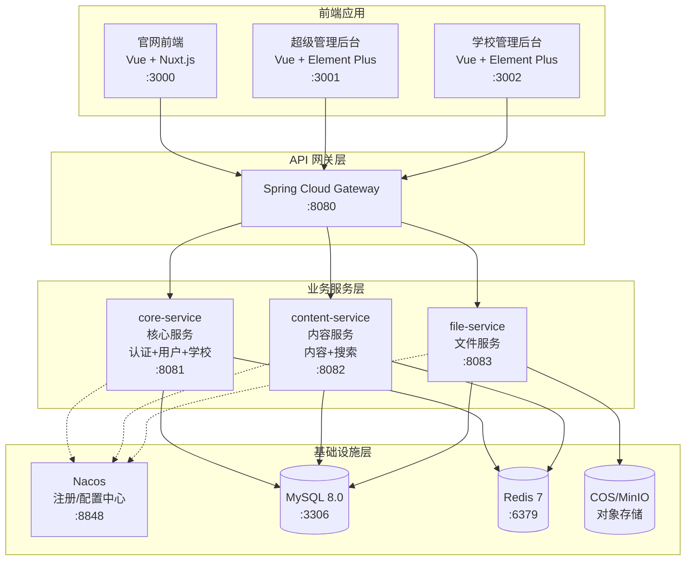

# 三、服务拓扑 {#components}
<!-- Section ID: Components -->

## 3.1 微服务划分



## 3.2 服务职责定义

| 服务名称 | 端口 | 职责描述 | 主要功能 |
|----------|------|----------|----------|
| **gateway** | 8080 | API 网关 | 路由转发、认证校验、限流熔断、日志记录 |
| **core-service** | 8081 | 核心服务 | 登录认证(含首次改密)、Token 管理、管理员账号(手机号注册)、权限管理、示范校管理、成员校管理、校共体介绍、校共同体活动、月报、站点配置(Logo/名称/版权) |
| **content-service** | 8082 | 内容服务 | 政策文件(含发文机构)、新闻资讯(导航不显示)、资源共享(含描述富文本)、项目介绍(单页)、轮播图管理、栏目管理、全站搜索、敏感词过滤 |
| **file-service** | 8083 | 文件服务 | 文件上传、下载、预览、COS/MinIO 管理 |

## 3.3 服务间依赖关系

```
gateway
├── core-service (认证校验、首次登录改密)
├── content-service
└── file-service

core-service
├── file-service (学校图片、背景图、月报附件、Logo上传)
└── content-service (校共同体活动同步至新闻资讯)

content-service
├── file-service (政策PDF、资源文件、轮播图上传)
└── core-service (获取学校信息用于新闻来源标识)
```

---
