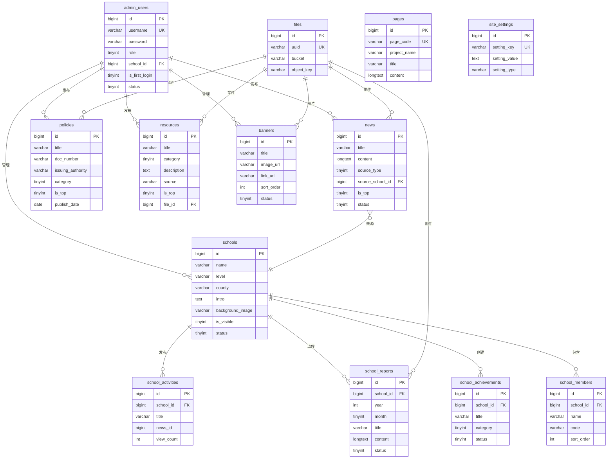

# 五、数据库设计 {#database-schema}
<!-- Section ID: Database Schema -->

## 5.1 数据库架构

采用 **逻辑分库** 策略，每个微服务使用独立的 Schema：

| Schema | 服务 | 说明 |
|--------|------|------|
| `edu_core` | core-service | 用户、认证、学校相关表 |
| `edu_content` | content-service | 内容管理、搜索相关表 |
| `edu_file` | file-service | 文件管理表 |

## 5.2 核心表设计

### 5.2.1 管理员表 (edu_core.admin_users)

```sql
CREATE TABLE admin_users (
    id BIGINT PRIMARY KEY AUTO_INCREMENT COMMENT '主键ID',
    username VARCHAR(50) NOT NULL UNIQUE COMMENT '账号(必须为11位手机号)',
    password VARCHAR(255) NOT NULL COMMENT '密码(BCrypt加密)',
    salt VARCHAR(32) NOT NULL COMMENT '密码盐值',
    role TINYINT NOT NULL DEFAULT 2 COMMENT '角色: 1-超级管理员, 2-学校管理员',
    school_id BIGINT NULL COMMENT '关联学校ID(学校管理员必填)',
    phone VARCHAR(20) NULL COMMENT '联系电话',
    email VARCHAR(100) NULL COMMENT '邮箱',
    avatar VARCHAR(255) NULL COMMENT '头像URL',
    is_first_login TINYINT NOT NULL DEFAULT 1 COMMENT '是否首次登录: 0-否, 1-是(需强制改密)',
    status TINYINT NOT NULL DEFAULT 1 COMMENT '状态: 0-禁用, 1-启用',
    last_login_at DATETIME NULL COMMENT '最后登录时间',
    last_login_ip VARCHAR(45) NULL COMMENT '最后登录IP',
    login_fail_count INT NOT NULL DEFAULT 0 COMMENT '连续登录失败次数',
    locked_until DATETIME NULL COMMENT '锁定截止时间',
    created_by BIGINT NULL COMMENT '创建人ID',
    created_at DATETIME NOT NULL DEFAULT CURRENT_TIMESTAMP COMMENT '创建时间',
    updated_at DATETIME NOT NULL DEFAULT CURRENT_TIMESTAMP ON UPDATE CURRENT_TIMESTAMP COMMENT '更新时间',
    deleted_at DATETIME NULL COMMENT '删除时间(软删除)',

    INDEX idx_username (username),
    INDEX idx_school_id (school_id),
    INDEX idx_role (role),
    INDEX idx_status (status)
) ENGINE=InnoDB DEFAULT CHARSET=utf8mb4 COLLATE=utf8mb4_unicode_ci COMMENT='管理员表';
```

### 5.2.2 示范校表 (edu_core.schools)

```sql
CREATE TABLE schools (
    id BIGINT PRIMARY KEY AUTO_INCREMENT COMMENT '主键ID',
    name VARCHAR(100) NOT NULL COMMENT '学校名称',
    code VARCHAR(50) NULL COMMENT '学校代码',
    level VARCHAR(20) NOT NULL COMMENT '学段: 小学/中学/高中',
    province VARCHAR(50) NOT NULL DEFAULT '河南省' COMMENT '省',
    city VARCHAR(50) NOT NULL COMMENT '市',
    county VARCHAR(50) NOT NULL COMMENT '县/区',
    address VARCHAR(255) NULL COMMENT '详细地址',
    phone VARCHAR(20) NULL COMMENT '联系电话',
    intro TEXT NULL COMMENT '校共体详细介绍',
    model TEXT NULL COMMENT '共同体组建模式',
    advantage TEXT NULL COMMENT '核心优势',
    images JSON NULL COMMENT '学校环境图片',
    logo VARCHAR(255) NULL COMMENT '学校Logo',
    background_image VARCHAR(500) NULL COMMENT '页面背景图片URL(示范校共体页面)',
    is_visible TINYINT NOT NULL DEFAULT 1 COMMENT '是否在官网显示: 0-否, 1-是',
    status TINYINT NOT NULL DEFAULT 1 COMMENT '状态: 0-禁用, 1-启用',
    sort_order INT NOT NULL DEFAULT 0 COMMENT '排序(升序)',
    created_by BIGINT NULL COMMENT '创建人ID',
    created_at DATETIME NOT NULL DEFAULT CURRENT_TIMESTAMP COMMENT '创建时间',
    updated_at DATETIME NOT NULL DEFAULT CURRENT_TIMESTAMP ON UPDATE CURRENT_TIMESTAMP COMMENT '更新时间',
    deleted_at DATETIME NULL COMMENT '删除时间(软删除)',

    INDEX idx_name (name),
    INDEX idx_level (level),
    INDEX idx_city (city),
    INDEX idx_status (status),
    INDEX idx_is_visible (is_visible),
    INDEX idx_sort_order (sort_order)
) ENGINE=InnoDB DEFAULT CHARSET=utf8mb4 COLLATE=utf8mb4_unicode_ci COMMENT='示范校表';
```

### 5.2.3 新闻资讯表 (edu_content.news)

```sql
CREATE TABLE news (
    id BIGINT PRIMARY KEY AUTO_INCREMENT COMMENT '主键ID',
    title VARCHAR(200) NOT NULL COMMENT '标题',
    content LONGTEXT NOT NULL COMMENT '内容(富文本)',
    cover_image VARCHAR(255) NULL COMMENT '封面图',
    source_type TINYINT NOT NULL DEFAULT 1 COMMENT '来源类型: 1-平台, 2-学校',
    source_school_id BIGINT NULL COMMENT '来源学校ID',
    attachments JSON NULL COMMENT '附件列表',
    external_link VARCHAR(500) NULL COMMENT '外部链接',
    view_count INT NOT NULL DEFAULT 0 COMMENT '浏览次数',
    status TINYINT NOT NULL DEFAULT 0 COMMENT '状态: 0-草稿, 1-已发布, 2-已删除',
    is_top TINYINT NOT NULL DEFAULT 0 COMMENT '是否置顶: 0-否, 1-是',
    publish_time DATETIME NULL COMMENT '发布时间',
    created_by BIGINT NOT NULL COMMENT '创建人ID',
    created_at DATETIME NOT NULL DEFAULT CURRENT_TIMESTAMP COMMENT '创建时间',
    updated_at DATETIME NOT NULL DEFAULT CURRENT_TIMESTAMP ON UPDATE CURRENT_TIMESTAMP COMMENT '更新时间',
    deleted_at DATETIME NULL COMMENT '删除时间(软删除)',
    deleted_by BIGINT NULL COMMENT '删除人ID',
    delete_reason VARCHAR(255) NULL COMMENT '删除原因',

    INDEX idx_source_type (source_type),
    INDEX idx_source_school_id (source_school_id),
    INDEX idx_status (status),
    INDEX idx_publish_time (publish_time),
    INDEX idx_is_top (is_top),
    FULLTEXT INDEX ft_title_content (title, content) WITH PARSER ngram
) ENGINE=InnoDB DEFAULT CHARSET=utf8mb4 COLLATE=utf8mb4_unicode_ci COMMENT='新闻资讯表(导航不显示,首页入口访问)';
```

### 5.2.4 政策文件表 (edu_content.policies)

```sql
CREATE TABLE policies (
    id BIGINT PRIMARY KEY AUTO_INCREMENT COMMENT '主键ID',
    title VARCHAR(200) NOT NULL COMMENT '标题',
    doc_number VARCHAR(100) NULL COMMENT '文号(后台存储,前端详情页不展示)',
    issuing_authority VARCHAR(200) NULL COMMENT '发文机构(非必填)',
    category TINYINT NOT NULL COMMENT '分类: 1-国家政策, 2-省级政策',
    content LONGTEXT NOT NULL COMMENT '内容(富文本)',
    pdf_url VARCHAR(500) NULL COMMENT 'PDF文件地址',
    external_link VARCHAR(500) NULL COMMENT '外部链接',
    interpretation TEXT NULL COMMENT '解读材料',
    publish_date DATE NOT NULL COMMENT '发布日期',
    is_top TINYINT NOT NULL DEFAULT 0 COMMENT '是否置顶: 0-否, 1-是',
    status TINYINT NOT NULL DEFAULT 1 COMMENT '状态: 0-草稿, 1-已发布',
    sort_order INT NOT NULL DEFAULT 0 COMMENT '排序',
    view_count INT NOT NULL DEFAULT 0 COMMENT '浏览次数',
    download_count INT NOT NULL DEFAULT 0 COMMENT '下载次数',
    created_by BIGINT NOT NULL COMMENT '创建人ID',
    created_at DATETIME NOT NULL DEFAULT CURRENT_TIMESTAMP COMMENT '创建时间',
    updated_at DATETIME NOT NULL DEFAULT CURRENT_TIMESTAMP ON UPDATE CURRENT_TIMESTAMP COMMENT '更新时间',
    deleted_at DATETIME NULL COMMENT '删除时间(软删除)',

    INDEX idx_category (category),
    INDEX idx_publish_date (publish_date),
    INDEX idx_status (status),
    INDEX idx_is_top (is_top),
    FULLTEXT INDEX ft_title (title) WITH PARSER ngram
) ENGINE=InnoDB DEFAULT CHARSET=utf8mb4 COLLATE=utf8mb4_unicode_ci COMMENT='政策文件表';
```

### 5.2.5 资源共享表 (edu_content.resources)

```sql
CREATE TABLE resources (
    id BIGINT PRIMARY KEY AUTO_INCREMENT COMMENT '主键ID',
    title VARCHAR(200) NOT NULL COMMENT '标题',
    category TINYINT NOT NULL COMMENT '分类: 1-省外经验, 2-省内经验, 3-研究文献',
    description TEXT NULL COMMENT '资源描述(富文本)',
    source VARCHAR(200) NULL COMMENT '来源(手动输入)',
    file_id BIGINT NULL COMMENT '文件ID',
    file_url VARCHAR(500) NULL COMMENT '文件地址',
    external_link VARCHAR(500) NULL COMMENT '外部链接',
    file_size BIGINT NULL COMMENT '文件大小(字节)',
    file_type VARCHAR(20) NULL COMMENT '文件类型',
    download_count INT NOT NULL DEFAULT 0 COMMENT '下载次数',
    is_top TINYINT NOT NULL DEFAULT 0 COMMENT '是否置顶: 0-否, 1-是',
    status TINYINT NOT NULL DEFAULT 1 COMMENT '状态: 0-草稿, 1-已发布',
    school_id BIGINT NULL COMMENT '上传学校ID(用于学校管理员删除权限判断)',
    created_by BIGINT NOT NULL COMMENT '创建人ID',
    created_at DATETIME NOT NULL DEFAULT CURRENT_TIMESTAMP COMMENT '创建时间',
    updated_at DATETIME NOT NULL DEFAULT CURRENT_TIMESTAMP ON UPDATE CURRENT_TIMESTAMP COMMENT '更新时间',
    deleted_at DATETIME NULL COMMENT '删除时间(软删除)',

    INDEX idx_category (category),
    INDEX idx_status (status),
    INDEX idx_is_top (is_top),
    INDEX idx_school_id (school_id),
    FULLTEXT INDEX ft_title (title) WITH PARSER ngram
) ENGINE=InnoDB DEFAULT CHARSET=utf8mb4 COLLATE=utf8mb4_unicode_ci COMMENT='资源共享表';
```

### 5.2.6 校共同体活动表 (edu_core.school_activities)

> **说明**：对应PRD中的"校共同体活动"功能，表名使用 `school_activities`。

```sql
CREATE TABLE school_activities (
    id BIGINT PRIMARY KEY AUTO_INCREMENT COMMENT '主键ID',
    school_id BIGINT NOT NULL COMMENT '学校ID',
    title VARCHAR(200) NOT NULL COMMENT '标题',
    content LONGTEXT NOT NULL COMMENT '内容(富文本)',
    cover_image VARCHAR(255) NULL COMMENT '封面图',
    attachments JSON NULL COMMENT '附件列表',
    external_link VARCHAR(500) NULL COMMENT '外部链接',
    news_id BIGINT NULL COMMENT '同步到新闻的ID',
    view_count INT NOT NULL DEFAULT 0 COMMENT '浏览次数',
    status TINYINT NOT NULL DEFAULT 1 COMMENT '状态: 0-草稿, 1-已发布',
    publish_time DATETIME NULL COMMENT '发布时间',
    created_by BIGINT NOT NULL COMMENT '创建人ID',
    created_at DATETIME NOT NULL DEFAULT CURRENT_TIMESTAMP COMMENT '创建时间',
    updated_at DATETIME NOT NULL DEFAULT CURRENT_TIMESTAMP ON UPDATE CURRENT_TIMESTAMP COMMENT '更新时间',
    deleted_at DATETIME NULL COMMENT '删除时间(软删除)',

    INDEX idx_school_id (school_id),
    INDEX idx_status (status),
    INDEX idx_publish_time (publish_time),
    FOREIGN KEY (school_id) REFERENCES schools(id) ON DELETE CASCADE
) ENGINE=InnoDB DEFAULT CHARSET=utf8mb4 COLLATE=utf8mb4_unicode_ci COMMENT='校共同体活动表';
```

### 5.2.7 月报表 (edu_core.school_reports)

```sql
CREATE TABLE school_reports (
    id BIGINT PRIMARY KEY AUTO_INCREMENT COMMENT '主键ID',
    school_id BIGINT NOT NULL COMMENT '学校ID',
    year INT NOT NULL COMMENT '年份',
    month TINYINT NOT NULL COMMENT '月份(1-12)',
    title VARCHAR(200) NOT NULL COMMENT '标题',
    content LONGTEXT NULL COMMENT '月报内容(富文本HTML)',
    cover_image VARCHAR(255) NULL COMMENT '封面图',
    attachments JSON NULL COMMENT '附件列表(PDF/Word等,可选)',
    view_count INT NOT NULL DEFAULT 0 COMMENT '浏览次数',
    status TINYINT NOT NULL DEFAULT 1 COMMENT '状态: 0-草稿, 1-已发布',
    publish_time DATETIME NULL COMMENT '发布时间',
    created_by BIGINT NOT NULL COMMENT '创建人ID',
    created_at DATETIME NOT NULL DEFAULT CURRENT_TIMESTAMP COMMENT '创建时间',
    updated_at DATETIME NOT NULL DEFAULT CURRENT_TIMESTAMP ON UPDATE CURRENT_TIMESTAMP COMMENT '更新时间',
    deleted_at DATETIME NULL COMMENT '删除时间(软删除)',

    INDEX idx_school_id (school_id),
    INDEX idx_year_month (year, month),
    INDEX idx_status (status),
    UNIQUE KEY uk_school_year_month (school_id, year, month, deleted_at),
    FOREIGN KEY (school_id) REFERENCES schools(id) ON DELETE CASCADE
) ENGINE=InnoDB DEFAULT CHARSET=utf8mb4 COLLATE=utf8mb4_unicode_ci COMMENT='月报表';
```

### 5.2.8 资源成果表 (edu_core.school_achievements)【二期规划】

> **注意**：资源成果功能为二期规划内容，一期暂不创建此表。以下表结构保留供二期参考。

```sql
CREATE TABLE school_achievements (
    id BIGINT PRIMARY KEY AUTO_INCREMENT COMMENT '主键ID',
    school_id BIGINT NOT NULL COMMENT '学校ID',
    title VARCHAR(200) NOT NULL COMMENT '标题',
    category TINYINT NOT NULL COMMENT '分类: 1-课程资源, 2-案例材料, 3-成果报告',
    content LONGTEXT NULL COMMENT '内容描述(富文本)',
    cover_image VARCHAR(255) NULL COMMENT '封面图',
    attachments JSON NULL COMMENT '附件列表',
    external_link VARCHAR(500) NULL COMMENT '外部链接',
    is_preview_enabled TINYINT NOT NULL DEFAULT 1 COMMENT '是否支持在线预览: 0-否, 1-是',
    view_count INT NOT NULL DEFAULT 0 COMMENT '浏览次数',
    download_count INT NOT NULL DEFAULT 0 COMMENT '下载次数',
    status TINYINT NOT NULL DEFAULT 1 COMMENT '状态: 0-草稿, 1-已发布',
    publish_time DATETIME NULL COMMENT '发布时间',
    created_by BIGINT NOT NULL COMMENT '创建人ID',
    created_at DATETIME NOT NULL DEFAULT CURRENT_TIMESTAMP COMMENT '创建时间',
    updated_at DATETIME NOT NULL DEFAULT CURRENT_TIMESTAMP ON UPDATE CURRENT_TIMESTAMP COMMENT '更新时间',
    deleted_at DATETIME NULL COMMENT '删除时间(软删除)',

    INDEX idx_school_id (school_id),
    INDEX idx_category (category),
    INDEX idx_status (status),
    FULLTEXT INDEX ft_title (title) WITH PARSER ngram,
    FOREIGN KEY (school_id) REFERENCES schools(id) ON DELETE CASCADE
) ENGINE=InnoDB DEFAULT CHARSET=utf8mb4 COLLATE=utf8mb4_unicode_ci COMMENT='学校资源成果表';
```

### 5.2.9 成员校表 (edu_core.school_members)

```sql
CREATE TABLE school_members (
    id BIGINT PRIMARY KEY AUTO_INCREMENT COMMENT '主键ID',
    school_id BIGINT NOT NULL COMMENT '所属示范校ID',
    name VARCHAR(100) NOT NULL COMMENT '成员校名称',
    code VARCHAR(50) NULL COMMENT '成员校代码',
    sort_order INT NOT NULL DEFAULT 0 COMMENT '排序(升序)',
    created_by BIGINT NOT NULL COMMENT '创建人ID',
    created_at DATETIME NOT NULL DEFAULT CURRENT_TIMESTAMP COMMENT '创建时间',
    updated_at DATETIME NOT NULL DEFAULT CURRENT_TIMESTAMP ON UPDATE CURRENT_TIMESTAMP COMMENT '更新时间',

    INDEX idx_school_id (school_id),
    INDEX idx_sort_order (sort_order),
    FOREIGN KEY (school_id) REFERENCES schools(id) ON DELETE CASCADE
) ENGINE=InnoDB DEFAULT CHARSET=utf8mb4 COLLATE=utf8mb4_unicode_ci COMMENT='成员校表';
```

### 5.2.10 单页内容表 (edu_content.pages)

```sql
CREATE TABLE pages (
    id BIGINT PRIMARY KEY AUTO_INCREMENT COMMENT '主键ID',
    page_code VARCHAR(50) NOT NULL UNIQUE COMMENT '页面代码(唯一标识,如about)',
    project_name VARCHAR(200) NULL COMMENT '项目名称(项目介绍页专用)',
    title VARCHAR(100) NOT NULL COMMENT '页面标题',
    content LONGTEXT NOT NULL COMMENT '页面内容(富文本HTML)',
    seo_title VARCHAR(200) NULL COMMENT 'SEO标题',
    seo_keywords VARCHAR(500) NULL COMMENT 'SEO关键词',
    seo_description VARCHAR(500) NULL COMMENT 'SEO描述',
    updated_by BIGINT NOT NULL COMMENT '最后编辑人ID',
    created_at DATETIME NOT NULL DEFAULT CURRENT_TIMESTAMP COMMENT '创建时间',
    updated_at DATETIME NOT NULL DEFAULT CURRENT_TIMESTAMP ON UPDATE CURRENT_TIMESTAMP COMMENT '更新时间',

    INDEX idx_page_code (page_code)
) ENGINE=InnoDB DEFAULT CHARSET=utf8mb4 COLLATE=utf8mb4_unicode_ci COMMENT='单页内容表';
```

### 5.2.11 站点配置表 (edu_core.site_settings)

```sql
CREATE TABLE site_settings (
    id BIGINT PRIMARY KEY AUTO_INCREMENT COMMENT '主键ID',
    setting_key VARCHAR(50) NOT NULL UNIQUE COMMENT '配置键',
    setting_value TEXT NULL COMMENT '配置值',
    setting_type VARCHAR(20) NOT NULL DEFAULT 'text' COMMENT '配置类型: text/image/json',
    description VARCHAR(200) NULL COMMENT '配置说明',
    updated_by BIGINT NULL COMMENT '最后修改人ID',
    created_at DATETIME NOT NULL DEFAULT CURRENT_TIMESTAMP COMMENT '创建时间',
    updated_at DATETIME NOT NULL DEFAULT CURRENT_TIMESTAMP ON UPDATE CURRENT_TIMESTAMP COMMENT '更新时间',

    INDEX idx_setting_key (setting_key)
) ENGINE=InnoDB DEFAULT CHARSET=utf8mb4 COLLATE=utf8mb4_unicode_ci COMMENT='站点配置表';

-- 预置配置项
INSERT INTO site_settings (setting_key, setting_value, setting_type, description) VALUES
('site_logo', NULL, 'image', '网站Logo'),
('site_name', '河南城乡学校共同体发展平台', 'text', '网站名称'),
('copyright', NULL, 'text', '版权信息'),
('friend_links', '[]', 'json', '友情链接列表');
```

### 5.2.12 轮播图表 (edu_content.banners)

```sql
CREATE TABLE banners (
    id BIGINT PRIMARY KEY AUTO_INCREMENT COMMENT '主键ID',
    title VARCHAR(100) NOT NULL COMMENT '标题',
    image_url VARCHAR(500) NOT NULL COMMENT '图片地址',
    link_url VARCHAR(500) NULL COMMENT '跳转链接',
    link_type TINYINT NOT NULL DEFAULT 1 COMMENT '链接类型: 1-内部链接, 2-外部链接',
    sort_order INT NOT NULL DEFAULT 0 COMMENT '排序(升序)',
    status TINYINT NOT NULL DEFAULT 1 COMMENT '状态: 0-隐藏, 1-显示',
    start_time DATETIME NULL COMMENT '开始展示时间',
    end_time DATETIME NULL COMMENT '结束展示时间',
    created_by BIGINT NOT NULL COMMENT '创建人ID',
    created_at DATETIME NOT NULL DEFAULT CURRENT_TIMESTAMP COMMENT '创建时间',
    updated_at DATETIME NOT NULL DEFAULT CURRENT_TIMESTAMP ON UPDATE CURRENT_TIMESTAMP COMMENT '更新时间',
    deleted_at DATETIME NULL COMMENT '删除时间(软删除)',

    INDEX idx_status (status),
    INDEX idx_sort_order (sort_order)
) ENGINE=InnoDB DEFAULT CHARSET=utf8mb4 COLLATE=utf8mb4_unicode_ci COMMENT='轮播图表';
```

### 5.2.14 文件表 (edu_file.files)

```sql
CREATE TABLE files (
    id BIGINT PRIMARY KEY AUTO_INCREMENT COMMENT '主键ID',
    uuid VARCHAR(36) NOT NULL UNIQUE COMMENT 'UUID',
    bucket VARCHAR(50) NOT NULL COMMENT 'MinIO Bucket',
    object_key VARCHAR(255) NOT NULL COMMENT 'MinIO Object Key',
    original_name VARCHAR(255) NOT NULL COMMENT '原始文件名',
    file_size BIGINT NOT NULL COMMENT '文件大小(字节)',
    mime_type VARCHAR(100) NOT NULL COMMENT 'MIME类型',
    file_ext VARCHAR(20) NOT NULL COMMENT '文件扩展名',
    file_type TINYINT NOT NULL COMMENT '文件类型: 1-图片, 2-文档, 3-视频',
    md5 VARCHAR(32) NULL COMMENT '文件MD5',
    upload_by BIGINT NOT NULL COMMENT '上传人ID',
    ref_count INT NOT NULL DEFAULT 1 COMMENT '引用计数',
    created_at DATETIME NOT NULL DEFAULT CURRENT_TIMESTAMP COMMENT '创建时间',
    deleted_at DATETIME NULL COMMENT '删除时间(软删除)',

    INDEX idx_uuid (uuid),
    INDEX idx_bucket_key (bucket, object_key),
    INDEX idx_file_type (file_type),
    INDEX idx_upload_by (upload_by)
) ENGINE=InnoDB DEFAULT CHARSET=utf8mb4 COLLATE=utf8mb4_unicode_ci COMMENT='文件表';
```

### 5.2.15 敏感词表 (edu_content.sensitive_words)

```sql
CREATE TABLE sensitive_words (
    id BIGINT PRIMARY KEY AUTO_INCREMENT COMMENT '主键ID',
    word VARCHAR(100) NOT NULL COMMENT '敏感词',
    category VARCHAR(50) NULL COMMENT '分类',
    level TINYINT NOT NULL DEFAULT 1 COMMENT '级别: 1-警告, 2-禁止',
    status TINYINT NOT NULL DEFAULT 1 COMMENT '状态: 0-禁用, 1-启用',
    created_by BIGINT NOT NULL COMMENT '创建人ID',
    created_at DATETIME NOT NULL DEFAULT CURRENT_TIMESTAMP COMMENT '创建时间',

    UNIQUE KEY uk_word (word),
    INDEX idx_category (category),
    INDEX idx_status (status)
) ENGINE=InnoDB DEFAULT CHARSET=utf8mb4 COLLATE=utf8mb4_unicode_ci COMMENT='敏感词表';
```

### 5.2.16 操作日志表 (edu_core.operation_logs)

```sql
CREATE TABLE operation_logs (
    id BIGINT PRIMARY KEY AUTO_INCREMENT COMMENT '主键ID',
    user_id BIGINT NOT NULL COMMENT '操作人ID',
    username VARCHAR(50) NOT NULL COMMENT '操作人账号',
    module VARCHAR(50) NOT NULL COMMENT '模块',
    action VARCHAR(50) NOT NULL COMMENT '操作类型',
    target_type VARCHAR(50) NULL COMMENT '操作对象类型',
    target_id BIGINT NULL COMMENT '操作对象ID',
    description VARCHAR(500) NOT NULL COMMENT '操作描述',
    request_method VARCHAR(10) NULL COMMENT '请求方法',
    request_url VARCHAR(255) NULL COMMENT '请求URL',
    request_params TEXT NULL COMMENT '请求参数',
    response_code INT NULL COMMENT '响应码',
    ip VARCHAR(45) NOT NULL COMMENT 'IP地址',
    user_agent VARCHAR(500) NULL COMMENT 'User-Agent',
    duration INT NULL COMMENT '执行时长(ms)',
    created_at DATETIME NOT NULL DEFAULT CURRENT_TIMESTAMP COMMENT '创建时间',

    INDEX idx_user_id (user_id),
    INDEX idx_module (module),
    INDEX idx_action (action),
    INDEX idx_created_at (created_at)
) ENGINE=InnoDB DEFAULT CHARSET=utf8mb4 COLLATE=utf8mb4_unicode_ci COMMENT='操作日志表';
```

## 5.3 ER 关系图



---
